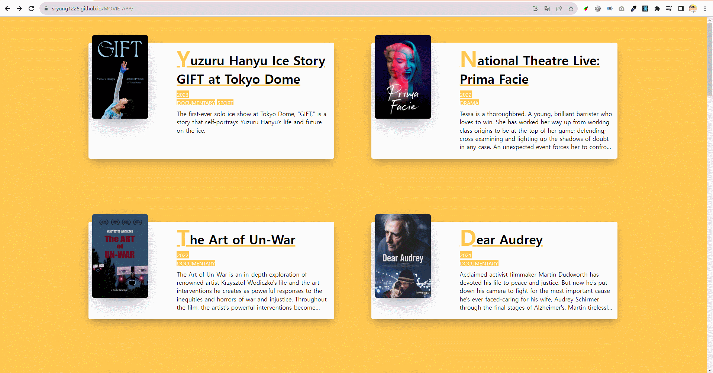

# 🎬 MOVIE-APP

노마드코더의 [[ReactJS로 영화 웹 서비스 만들기](https://nomadcoders.co/react-for-beginners)] 강의를 수강하면서  

ReactJS의 기본 문법을 알아보는 이론 공부 및 실습을 진행해보고  

강의의 최종 실습 과제인 영화 소개 웹페이지를 제작했습니다.

> https://sryung1225.github.io/MOVIE-APP/

(권장 사용 환경 : Window10, Chrome)

--

## 💁‍♀️ 웹페이지 소개

기본적으로 영화 정보를 제공하는 API를 활용해 데이터를 가져와 화면에 렌더링합니다.  

React Router를 통해 모든 영화 정보를 노출하는 HOME 페이지와  

각 영화의 세부 정보를 확인할 수 있는 DETAIL 페이지로 구성했습니다.  

 

 

 

이론 및 세부 작업 정리 : [[📚 Notion](https://eve1225.notion.site/7-PRACTICE-MOVIE-APP-adde4940f1364dc38fbb3f6be141706c?pvs=4)]  
